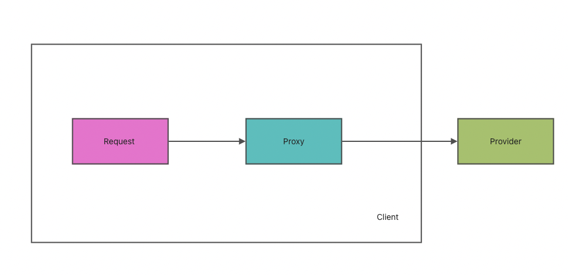
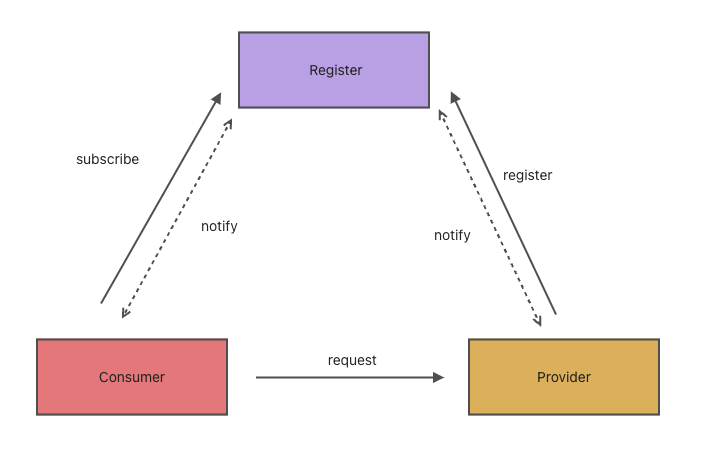
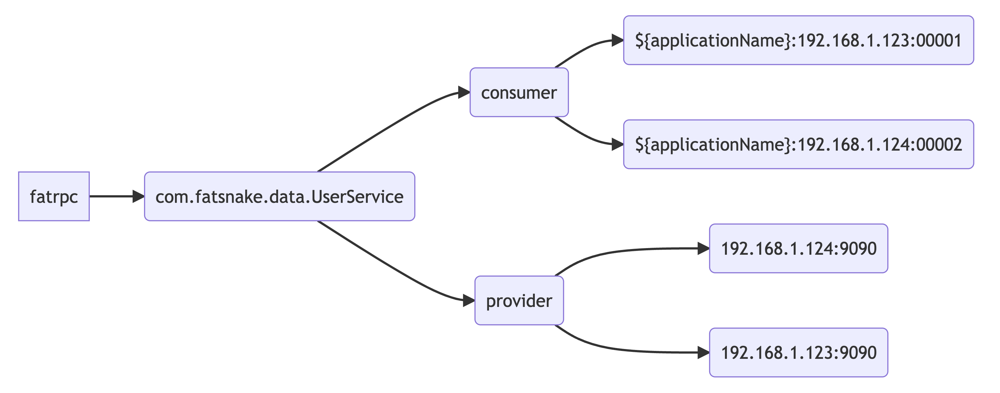
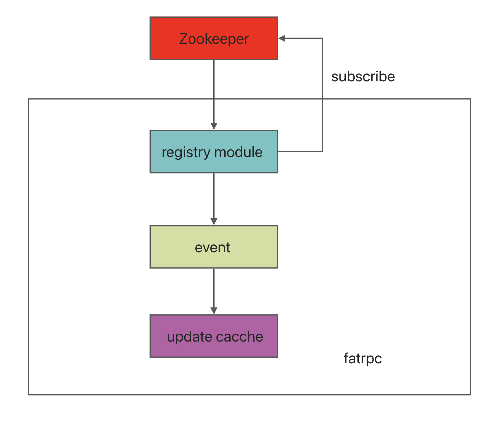
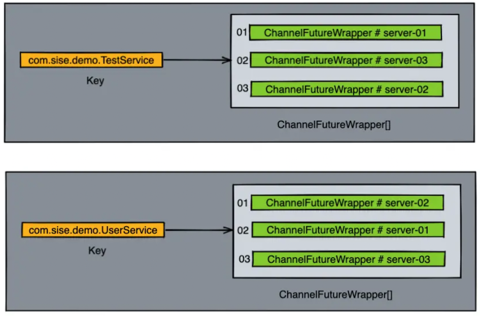
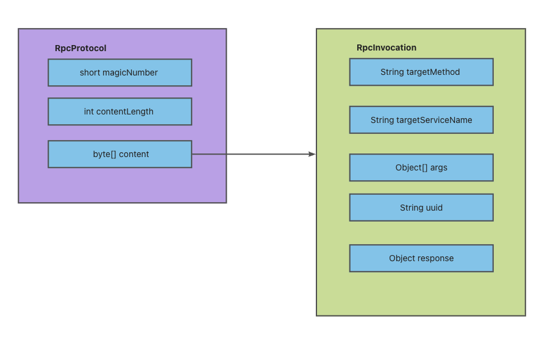
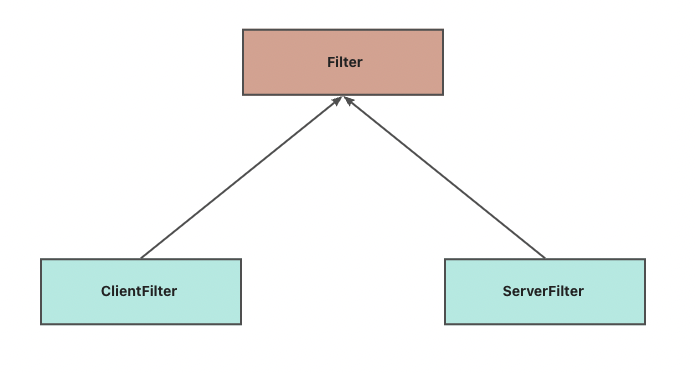

# fatrpc：一个自己实现的轻量级rpc框架

## 项目目的

纸上得来终觉浅，绝知此事要躬行 将自己所学只是应用练手，以及公司业务技术部门培训

## 整体结构与基本分层

- 代理层：负责对底层调用细节的封装；
- 路由层：负责在集群目标服务中的调用筛选策略；
- 协议层：负责请求数据的转码封装等作用；
- 链路层：负责执行一些自定义的过滤链路，可以供后期二次扩展；
- 注册中心层：关注服务的上下线，以及一些权重，配置动态调整等功能；
- 序列化层：负责将不同的序列化技术嵌套在框架中；
- 容错层：当服务调用出现失败之后需要有容错层的兜底辅助；
- 接入层：考虑如何与常用框架Spring的接入；
- 公共层：主要存放一些通用配置，工具类，缓存等信息。

注：为了方便进行单层测试，以及方便查看rpc框架演进的过程，不同层将产生不同分支中。待整体框架完成后，最新代码合并至master分支。

# fatpr框架的核心代码

# 主要功能

## 1.代理层实现

封装了统一的代理接口，合理引入了JDK代理和Javassist代理来实现网络传输的功能。

- jdk
- Javassist

  

## 2.数据传输粘包与拆包

netty内部在做数据传输的时候，需要考虑到拆包和粘包部分的逻辑，在进行socket编程的时候， 服务器和客户端之间进行数据通信的时候需要保证数据的有序和稳定。但是socket之间的通信经常会遇到tcp粘包、拆包的问题。

业界也有统一的解决手段：

- 固定长度文本传输 根据名称，我们就可以比较好地理解定长文本传输的含义，提前制定好每次请求的报文长度，假设一份数据报文的规定长度为9个字节，那么服务端每当接收满了9个字节，才会当作数据包传输完整。

- 特殊分割字符传输 规定好每次传输的数据报文需要用统一的分割字符来进行划分。

- 固定协议传输（通过自定协议RpcProtocol解决） 定义好相关的传输协议体，服务端会将接收的数据流信息转换为协议体，当协议体转换一旦成功，就代表数据包发送完整了。

## 3.基于Netty的服务端通信模型

## 4.基于Netty的客户端通信模型

## 5.客户端异步发送消息设计

通过队列实现异步发送消息设计，通过uuid来标示请求线程和响应线程之间的数据匹配问题。

## 6.引入注册中心

### 要实现功能

- 能够存储数据，并且具备高可用
- 能够和各个调用方保持连接，当有服务上线/下线的时候需要通知到各端

  

### 技术选型：Zookeeper原因

- Zookeeper和客户端之间可以构成主动推送，能够实现服务上线和下线时的通知效果。
- Zookeeper自身提供了高可用的机制，并且对于数据节点的存储可以支持顺序、非顺序，临时、持久化的特性。
- Zookeeper自身也是一款非常成熟的中间件，业界有很多关于它的解决方案，开源社区也比较活跃。

### 注册节点的结构设计

此处参照了些dubbo注册节点的结构设计

- 根节点：fatrpc
- 一节节点: 不同服务名称如：com.fatsnake.data.UserService
- 二级节点：分为provider和consumer节点
- 三级节点：provider下存放的数据以ip+端口的格式存储，consumer下边存放具体的服务调用服务名与地址。
  

### 节点变更，更新数据设计思路

此处引入事件的设计思路，主要是为了异步与解耦 当监听到某个节点的数据发生更新之后，会发送一个节点更新的事件，然后在事件的监听端对不同的行为做不同的事件处理操作。

## 7.路由层

如果只有一个服务提供者的话，其实很好处理调用问题，直接根据ip + port去请求即可。如果有多个服务提供者的话， 则需要有一套合适的负载均衡算法去计算合适的服务提供方方，然后发起网络调用

### 简单的随机(Random)调用服务存在的缺陷

- 假设目标机器的性能不一，如何对机器进行权重分配？
- 每次都要执行Random函数，在高并发情况下对CPU的消耗会比较高。 Random内部实现使用 [随机算法线性同余法](https://zhuanlan.zhihu.com/p/36301602)
- 如何基于路由策略做ABTest？

### 优化随机调用的设计思路

假设在进行远程调用的时候，预先产生一个随机数组，该数组定义好了需要调用的服务提供者顺序，接下来按照这个随机顺序去做轮询，其实达成的效果也是一样的。

所以设计思路是： 在客户端和服务提供者进行连接建立的环节会触发路由层的一个refreshRouterArr函数，生成对应先后顺序的随机数组，并且将其存放在一个map集合中。

### 核心对象存储结构

### 其他常见负载均衡算法
-  最小连接数

最小连接数负载均衡算法需要记录每个应用服务器正在处理的连接数，然后将新来的请求转发到最少的那台上。但是对于每台服务器的请求量都需要做记录
并且上报到一个固定的位置，并且通知到客户端每台目标服务器当前的连接数状态，实现起来会比较复杂。

- 分布式哈希的一致性

分布式哈希的一致性算法在实际使用的时候可能会出现“哈希倾斜” 的问题，为了解决这类问题，通常在算法的内部会设计一些虚拟节点的存在，从而平衡请求的均匀性。

- ip的hash算法

ip的hash算法通常是将源地址通过hash计算，定位到具体的一台机器上。但是如果一旦某台机器出现奔溃的话，该ip的请求就会直接崩溃，对于容错性来说不强。

## 8.序列化层
RpcProtocol主要将content属性，也就是一个RpcInvocation对象如何序列化与反序列化

### 抽出统一序列化接口
SerializeFactory

### 实现常见序列化技术
- JDK
- Hessian
- Kryo
- FastJson
### 对序列化技术的测试
#### 考察方向
主要考察这个技术的吞吐量，代表性的指标：
- 产生的码流大小
- 序列化处理的速度

往上主流答案是kryo>hessian>fastjson>jdk
但是实际测试（jmh），FastJson效果最好，JDK效果最差

## 9.链路层
根据实际工作中一些实际场景，基于责任链模式开发，自定义一些过滤链路，可以方便二次扩展

### 常见需求场景
- 对client的请求作鉴权；
  
  对一些操作敏感信息的服务，如：涉及钱、用户信息等，做一些安全防范，需要在框架内部增加服务调用鉴权。
  大致思路：请求抵达服务端调用具体方法之前，先对其调用凭证进行判断操作，如果凭证不一致则抛出异常。

- 分组管理服务，方便不同功能分支并行开发或者测试；

  此需求一般在团队协助时出现，比如：测试同学验证调用服务，调到了开发同学正在开发的另一个需求功能分支上的"相同服务"。
  引入group属性，将服务按照组进行管理，测试同学的服务group设置为test，开发同学的设置成dev。
  
- 如何实现基于IP直连的方式访问server端？

按照指定ip访问的方式请求server端是我们在测试阶段会比较常见的方式，例如服务部署之后，发现2个名字相同的服务，面对相同的请求参数，
在两个服务节点中返回的结果却不一样，此时就可以通过指定请求ip来进行debug诊断。
  

- 调用过程中需要记录调用的相关日志信息。

每次请求都最好能有一次请求调用的记录，方便开发者调试。日志的内容一般会关注以下几个点：调用方信息，请求的具体服务的哪个方法，请求时间。

### 引入责任链模式
传统模式开发，需要修改客户端的代理层，需要修改服务端的netty的channelRead，每次加一个新功能都需要修改代码，耦合性强，对代码侵入性大。

#### 责任链模式
在责任链模式中，客户只需要将请求发送到责任链上即可，无须关心请求的处理细节和请求的传递过程，所以责任链将请求的发送者和请求的处理者解耦了。

使用责任链设计模式的好处：

- 发送者与接收方的处理对象类之间解耦。
- 封装每个处理对象，处理类的最小封装原则。
- 可以任意添加处理对象，调整处理对象之间的顺序，提高了维护性和可拓展性，可以根据需求新增处理类，满足开闭原则。
- 增强了对象职责指派的灵活性，当流程发生变化的时候，可以动态地改变链内的调动次序可动态的新增或者删除。
- 责任链简化了对象之间的连接。每个对象只需保持一个指向其后继者的引用，不需保持其他所有处理者的引用，这避免了使用众多的 if 或者 if···else 语句。
- 责任分担。每个类只需要处理自己该处理的工作，不该处理的传递给下一个对象完成，明确各类的责任范围，符合类的单一职责原则。

###### 过滤器拆分(分类)
将过滤器拆（Filter）分成两部分，服务端过滤器过滤器（ClientFilter），客户端过滤器（ServerFilter）

- 服务端过滤器（ServerFilter）

请求抵达服务端之后需要经过的过滤器

- 客户端过滤器（ClientFilter）

主要是客户端发起调用过程中需要经过的过滤器

