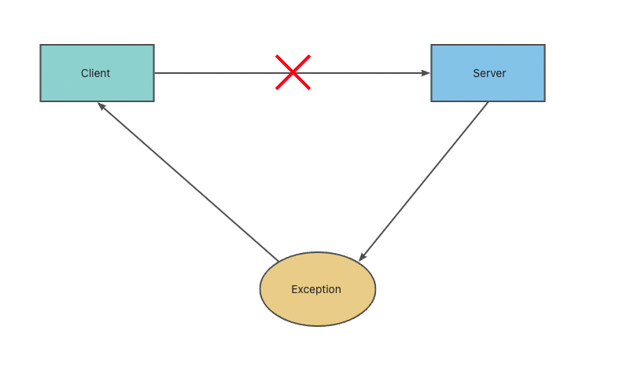
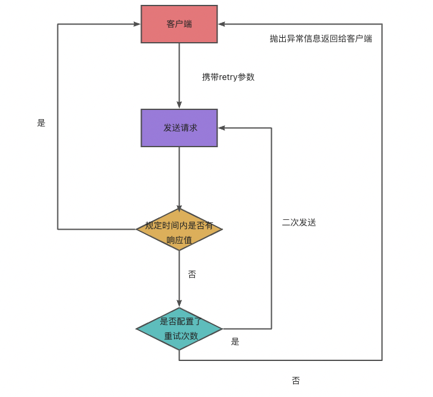
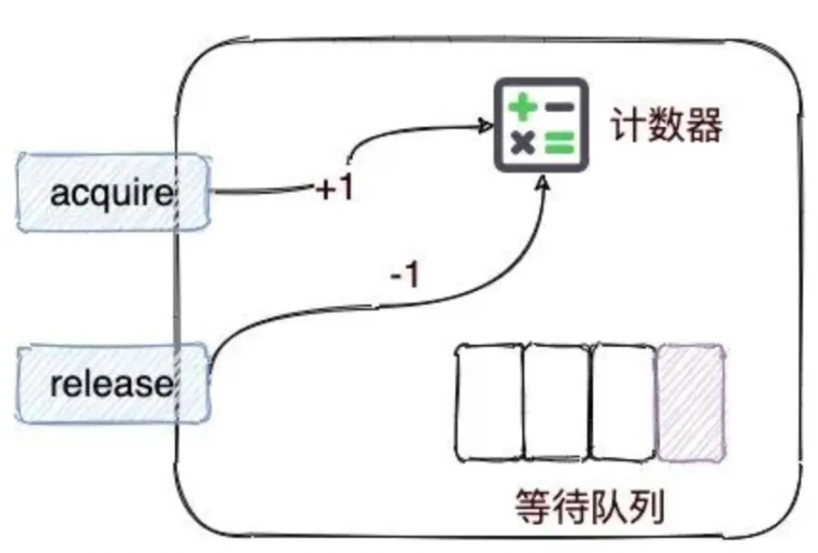

# fatrpc：一个自己实现的轻量级rpc框架

此文中多图显示不能显示请添加host https://www.cnblogs.com/Alex-goforit/p/15997737.html

## 项目目的

纸上得来终觉浅，绝知此事要躬行 将自己所学只是应用练手，以及公司业务技术部门培训

## 整体结构与基本分层

- 代理层：负责对底层调用细节的封装；
- 路由层：负责在集群目标服务中的调用筛选策略；
- 协议层：负责请求数据的转码封装等作用；
- 链路层：负责执行一些自定义的过滤链路，可以供后期二次扩展；
- 注册中心层：关注服务的上下线，以及一些权重，配置动态调整等功能；
- 序列化层：负责将不同的序列化技术嵌套在框架中；
- 容错层：当服务调用出现失败之后需要有容错层的兜底辅助；
- 接入层：考虑如何与常用框架Spring的接入；
- 公共层：主要存放一些通用配置，工具类，缓存等信息。

注：为了方便进行单层测试，以及方便查看rpc框架演进的过程，不同层将产生不同分支中。待整体框架完成后，最新代码合并至master分支。

# fatpr框架的核心代码

# 主要功能

## 1.代理层实现

封装了统一的代理接口，合理引入了JDK代理和Javassist代理来实现网络传输的功能。

- jdk
- Javassist

  

## 2.数据传输粘包与拆包

netty内部在做数据传输的时候，需要考虑到拆包和粘包部分的逻辑，在进行socket编程的时候， 服务器和客户端之间进行数据通信的时候需要保证数据的有序和稳定。但是socket之间的通信经常会遇到tcp粘包、拆包的问题。

业界也有统一的解决手段：

- 固定长度文本传输 根据名称，我们就可以比较好地理解定长文本传输的含义，提前制定好每次请求的报文长度，假设一份数据报文的规定长度为9个字节，那么服务端每当接收满了9个字节，才会当作数据包传输完整。

- 特殊分割字符传输 规定好每次传输的数据报文需要用统一的分割字符来进行划分。

- 固定协议传输（通过自定协议RpcProtocol解决） 定义好相关的传输协议体，服务端会将接收的数据流信息转换为协议体，当协议体转换一旦成功，就代表数据包发送完整了。

## 3.基于Netty的服务端通信模型

## 4.基于Netty的客户端通信模型

## 5.客户端异步发送消息设计

通过队列实现异步发送消息设计，通过uuid来标示请求线程和响应线程之间的数据匹配问题。

## 6.引入注册中心

### 要实现功能

- 能够存储数据，并且具备高可用
- 能够和各个调用方保持连接，当有服务上线/下线的时候需要通知到各端

  

### 技术选型：Zookeeper原因

- Zookeeper和客户端之间可以构成主动推送，能够实现服务上线和下线时的通知效果。
- Zookeeper自身提供了高可用的机制，并且对于数据节点的存储可以支持顺序、非顺序，临时、持久化的特性。
- Zookeeper自身也是一款非常成熟的中间件，业界有很多关于它的解决方案，开源社区也比较活跃。

### 注册节点的结构设计

此处参照了些dubbo注册节点的结构设计

- 根节点：fatrpc
- 一节节点: 不同服务名称如：com.fatsnake.data.UserService
- 二级节点：分为provider和consumer节点
- 三级节点：provider下存放的数据以ip+端口的格式存储，consumer下边存放具体的服务调用服务名与地址。
  

### 节点变更，更新数据设计思路

此处引入事件的设计思路，主要是为了异步与解耦 当监听到某个节点的数据发生更新之后，会发送一个节点更新的事件，然后在事件的监听端对不同的行为做不同的事件处理操作。

## 7.路由层

如果只有一个服务提供者的话，其实很好处理调用问题，直接根据ip + port去请求即可。如果有多个服务提供者的话， 则需要有一套合适的负载均衡算法去计算合适的服务提供方方，然后发起网络调用

### 简单的随机(Random)调用服务存在的缺陷

- 假设目标机器的性能不一，如何对机器进行权重分配？
- 每次都要执行Random函数，在高并发情况下对CPU的消耗会比较高。 Random内部实现使用 [随机算法线性同余法](https://zhuanlan.zhihu.com/p/36301602)
- 如何基于路由策略做ABTest？

### 优化随机调用的设计思路

假设在进行远程调用的时候，预先产生一个随机数组，该数组定义好了需要调用的服务提供者顺序，接下来按照这个随机顺序去做轮询，其实达成的效果也是一样的。

所以设计思路是： 在客户端和服务提供者进行连接建立的环节会触发路由层的一个refreshRouterArr函数，生成对应先后顺序的随机数组，并且将其存放在一个map集合中。

### 核心对象存储结构

### 其他常见负载均衡算法

- 最小连接数

最小连接数负载均衡算法需要记录每个应用服务器正在处理的连接数，然后将新来的请求转发到最少的那台上。但是对于每台服务器的请求量都需要做记录 并且上报到一个固定的位置，并且通知到客户端每台目标服务器当前的连接数状态，实现起来会比较复杂。

- 分布式哈希的一致性

分布式哈希的一致性算法在实际使用的时候可能会出现“哈希倾斜” 的问题，为了解决这类问题，通常在算法的内部会设计一些虚拟节点的存在，从而平衡请求的均匀性。

- ip的hash算法

ip的hash算法通常是将源地址通过hash计算，定位到具体的一台机器上。但是如果一旦某台机器出现奔溃的话，该ip的请求就会直接崩溃，对于容错性来说不强。

## 8.序列化层

RpcProtocol主要将content属性，也就是一个RpcInvocation对象如何序列化与反序列化

### 抽出统一序列化接口

SerializeFactory

### 实现常见序列化技术

- JDK
- Hessian
- Kryo
- FastJson

### 对序列化技术的测试

#### 考察方向

主要考察这个技术的吞吐量，代表性的指标：

- 产生的码流大小
- 序列化处理的速度

往上主流答案是kryo>hessian>fastjson>jdk 但是实际测试（jmh），FastJson效果最好，JDK效果最差

## 9.链路层

根据实际工作中一些实际场景，基于责任链模式开发，自定义一些过滤链路，可以方便二次扩展

### 常见需求场景

- 对client的请求作鉴权；

  对一些操作敏感信息的服务，如：涉及钱、用户信息等，做一些安全防范，需要在框架内部增加服务调用鉴权。 大致思路：请求抵达服务端调用具体方法之前，先对其调用凭证进行判断操作，如果凭证不一致则抛出异常。

- 分组管理服务，方便不同功能分支并行开发或者测试；

  此需求一般在团队协助时出现，比如：测试同学验证调用服务，调到了开发同学正在开发的另一个需求功能分支上的"相同服务"。 引入group属性，将服务按照组进行管理，测试同学的服务group设置为test，开发同学的设置成dev。

- 如何实现基于IP直连的方式访问server端？

按照指定ip访问的方式请求server端是我们在测试阶段会比较常见的方式，例如服务部署之后，发现2个名字相同的服务，面对相同的请求参数， 在两个服务节点中返回的结果却不一样，此时就可以通过指定请求ip来进行debug诊断。

- 调用过程中需要记录调用的相关日志信息。

每次请求都最好能有一次请求调用的记录，方便开发者调试。日志的内容一般会关注以下几个点：调用方信息，请求的具体服务的哪个方法，请求时间。

### 引入责任链模式

传统模式开发，需要修改客户端的代理层，需要修改服务端的netty的channelRead，每次加一个新功能都需要修改代码，耦合性强，对代码侵入性大。

#### 责任链模式

在责任链模式中，客户只需要将请求发送到责任链上即可，无须关心请求的处理细节和请求的传递过程，所以责任链将请求的发送者和请求的处理者解耦了。

使用责任链设计模式的好处：

- 发送者与接收方的处理对象类之间解耦。
- 封装每个处理对象，处理类的最小封装原则。
- 可以任意添加处理对象，调整处理对象之间的顺序，提高了维护性和可拓展性，可以根据需求新增处理类，满足开闭原则。
- 增强了对象职责指派的灵活性，当流程发生变化的时候，可以动态地改变链内的调动次序可动态的新增或者删除。
- 责任链简化了对象之间的连接。每个对象只需保持一个指向其后继者的引用，不需保持其他所有处理者的引用，这避免了使用众多的 if 或者 if···else 语句。
- 责任分担。每个类只需要处理自己该处理的工作，不该处理的传递给下一个对象完成，明确各类的责任范围，符合类的单一职责原则。

###### 过滤器拆分(分类)

将过滤器拆（Filter）分成两部分，服务端过滤器过滤器（ClientFilter），客户端过滤器（ServerFilter）

- 服务端过滤器（ServerFilter）

请求抵达服务端之后需要经过的过滤器

- 客户端过滤器（ClientFilter）

主要是客户端发起调用过程中需要经过的过滤器

## 10.引入SPI，优化代码对象实例化

### 微内核的概念

大多数中间件产品都会参照微内核架构进行设计， 大意指的是： 将框架的核心独立出来，框架的API面向与业务开发人员，而核心的框架内部扩展功能可以交给一些经验丰富，能力更高的技术人员负责。
[什么是微内核？ - 码农的荒岛求生的回答 - 知乎](https://www.zhihu.com/question/339638625/answer/2449767703)

### SPI介绍

Service Provider Interface，它是一种通过外界配置来加载具体代码内容的技术手段。 Dubbo内部核心思想就是采用SPI这种扩展技术来实现可插拔式组件的。

### 目的

- 对前期版本硬编码的改善，可以通过配置化的方式来自定义插件部分。
- 对自定义负载均衡策略
- 自定义序列化算法技术
- 自定义代理工厂

常见实现思路： 在统一规定的文件目录底下，新建一份文件，并在该文件内部定义好需要加载的类，让核心程序在不坐内部源码修改的情况下， 引入可执行的代码逻辑。

### SPI分类

- JDK自带的SPI机制
- 自定义实现的SPI机制

#### JDK自带SPI

被广泛应用在各类驱动包，如：mysql-connector-java 缺点：

- 加载后立即初始化，耗费资源 在 META-INF/service 下的配置中如果存在 N个实现类，采用JDK自带的SPI机制会一次性将它们进行初始化加载。 在加载的过程中如果涉及到了一些比较耗时的操作，会非常浪费资源。

- 如果扩展点加载失败，会导致调用方报错，而且这个错误很难定位到是这个原因 。

#### 自定义实现的SPI
通过当前Class的类加载器去加载META-INF/fatrpc/目录底下存在的资源文件，并且将它们放入一个LinkedHashMap中。
不适用hashmap是为了保证放入map的顺序和配置编写的顺序保持一致。

## 11.高并发改造--队列与多线程
### 问题：NIO线程阻塞
Netty的ChannelHandler是业务代码和Netty框架交汇的地方，ChannelHandler里的业务逻辑，正常来说是由NioEventLoop（NIO）线程串行执行。

在服务端接收到新消息后，第一步要做的往往是用解码的handler解码消息的字节序列，字节序列解码后就变为了消息对象， 第二步将消息对象丢给后续
的业务handler处理，此时如果某个业务handler的流程非常耗时，比如需要查询数据库， 那么为了避免I/O线程（也就是Netty的NIO线程）被长时间
占用，需要使用额外的非I/O线程池来执行这些耗时的业务逻辑
#### NIO线程常见的堵塞情况
- 无意识：

在ChannelHandler中编写了可能导致NIO线程阻塞的代码，但是用户没有意识到，包括但不限于查询各种数据存储器的操作、第三方服务的远程调用、
中间件服务的调用、等待锁等。

- 有意识：

用户知道有耗时逻辑需要额外处理，但是在处理过程中翻车了，比如主动切换耗时逻辑到业务线程池或者业务的消息队列做处理时发生阻塞，最典型的有
对方是阻塞队列，锁竞争激烈导致耗时，或者投递异步任务给消息队列时异机房的网络耗时，或者任务队列满了导致等待，等等。

#### 为什么不交给NioEventLoopGroup的线程池处理
按照Reator的设计思想来说，还是不太建议这么做，bossGroup和workerGroup尽量专注于各类Nio事件的处理逻辑上，因为将业务具体任务丢入到
NioEventLoopGroup中执行，可能会导致IO处理任务和业务执行任务之间发生资源竞争，导致阻塞，面对具体的业务处理还是应当交由独立的业务线程
池来处理。

解决：使用单独一条队列在ServerHandler，通过设置足够长的队列长度，保证吞吐量

## 12.容错层
主要是涉及三个场景
- 服务端异常返回给调用方展示
- 客户端调用可以支持超时重试
- 服务提供方进行接口限流

### 场景一：服务端异常返回给调用方展示

如果将异常都打印在服务端，带来的问题
- 无法区分哪些异常是由哪些客户端发出的请求所致
- 客户端调用接口获取不到预期数据提示调用错误，但是所有异常堆栈信息记录在服务端的机器上，排查问题困难。
- 服务端的错误日志堆积远大于调用方，比较耗费磁盘空间

解决：将服务器的异常信息统一采集起来，返回给调用方并且将堆栈记录打印。

注： 由于返回的错误堆栈信息太多，会出现拆包问题
解决：协议体尾部加入了一个分隔符，并通过参数定义每次数传户的最大数据包体积，并且通过参数定义每次传输的最大数据包体积.

### 场景二：客户端调用可以支持超时重试
#### 重试应该出现的场景

- 缓解单点性能瓶颈

目标集群中有A，B服务器，A服务器性能不佳，处理请求比较缓慢，B服务器性能优于A，所以当接口调用A出现超时之后，可以尝试重新发起调用，将请求转到B上从而获取数据结果。
- 网络异常

网络因为某些特殊异常，导致突然间断，此时可以通过重试机制发起二次调用，这时候重试机制就对接口的整体可用性有了一定的保障。

#### 重试不应该出现的场景
对于一些对数据重复性较为敏感的接口，

例如转账，下单，以及一些和金融相关的接口，当接口调用出现超时之后，并不好确认数据包是否已经抵达到目标服务，所以这类场景下对接口设置超时重试功能需要有所斟酌。

解决：
如果出现超时异常，默认可以发起1次重试机会，如果不想使用重试功能，可以在配置中将对应方法的重试次数设置为0

### 场景三：服务提供方进行接口限流
需要保护的两个方面
- 控制业务应用整体的连接上限；
- 单个服务请求的限流。

#### 方面一：控制业务应用整体的连接上限
核心设计：
对服务端的要有一个统一的连接数控制，比如最大连接限制为512，
当前连接数超过512则超出的部分直接拒绝

具体实现：
MainReactor负责客户端的连接请求，将请求转发给SubReactor。
SubReactor负责相关通道的IO读写信息。
业务逻辑部分单独抽离出来交给了业务线程池处理。

注意细节：
- 当断开链接的时候，建议可以返回一些简单的数据包告知客户端，防止客户端的链接处于TIME_WAIT状态。
- 防止高并发请求下，突然大量请求抵达服务端，但是却被告知断开链接，此时为了防止打印重复的日志，
  可以采用定时记录的设计思想去实现。

  
#### 方面二：单个服务请求的限流
##### 主要核心思想
将过滤器链拆分为前置过滤器链和后置过滤器链，采用了Semaphore的组件进行实践。

- 前置过滤器：
请求数据在执行实际业务函数之前需要会经过前置过滤器的逻辑，而限流组件则是在前置过滤器的最后一环，主要负责tryAcquire环节。

- 后置过滤器
当业务核心逻辑执行完毕之后，会进入到后置过滤器中，这里面可以执行relase操作。

##### 关于限流策略acquire（堵塞->队列等待）与tryAcquire(立即响应异常，客户端发起二次重试)的权衡
- 如果使用acquire，随着并发量的增加吞吐率下降严重

在对acquire方法调用的时候，如果许可数减少为0则会堵塞当前调用线程，让客户端处于等待状态，面对大量并发的访问容易造成整体接口的平均响应时间
越来越大，导致整个服务的吞吐率越来越低

- 如果使用acquire，诱发频繁gc导致oom

当有大量请求因为acquire处于堵塞状态停留在服务端内存中的时候，容易导致内存上升，从而产生出现频繁gc升至oom异常，这种情况下就会将问题变
得越加严重。

- 如果使用tryAcquire，立即响应异常，客户端发起二次重试

使用tryAcquire则是一种“快速响应”的解决思路，当获取申请失败后，不会堵塞当前线程，而是立马通知客户端调用异常，然后发起二次重试，路由到其
他节点。至少这种策略相比于acquire来说不存在请求堆积，导致服务崩溃的风险因素。

#### 常见限流算法对比

限流算法名称	 | 算法思路	 | 优势
-------------|-----------|----
令牌桶算法    | 设计一个桶的概念，然后以恒定的速度往桶里面放入令牌，当桶满了之后就不再放入。每次有请求进入后端服务集群的时候，就顺便从桶里面取走一个令牌，如果没有令牌则会出现拒绝情况。	  | 设计思路比较简单，可以用于一些连接池，程序并发访问器等简单的组件。
固定窗口算法	 | 固定窗口就是定义一个“固定”的统计周期，比如 1 分钟或者 30 秒、10 秒这样。然后在每个周期统计当前周期中被接收到的请求数量，经过计数器累加后如果达到设定的阈值就触发「流量干预」。	  | 实现思路比较简单，可以有效控制指定时间周期内的流量访问规模。
滑动窗口算法	 | 通过定义一个滑动窗口，其内部包含了许多个更加细小的固定窗口，比如 1 分钟的固定窗口切分为 60 个 1 秒的滑动窗口。然后统计的时间范围随着时间的推移同步后移。	  | 能够较为平滑地保证整体流量访问的稳定性。

## 13.与spring的融合

