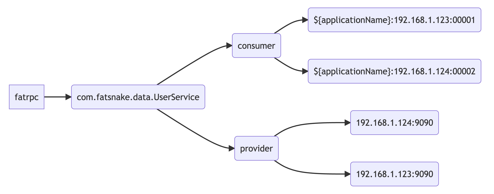

# fatpr框架的核心代码

# 主要功能

## 1.代理层实现

封装了统一的代理接口，合理引入了JDK代理和Javassist代理来实现网络传输的功能。

- jdk
- Javassist

## 2.数据传输粘包与拆包

netty内部在做数据传输的时候，需要考虑到拆包和粘包部分的逻辑，在进行socket编程的时候， 服务器和客户端之间进行数据通信的时候需要保证数据的有序和稳定。但是socket之间的通信经常会遇到tcp粘包、拆包的问题。

业界也有统一的解决手段：

- 固定长度文本传输 根据名称，我们就可以比较好地理解定长文本传输的含义，提前制定好每次请求的报文长度，假设一份数据报文的规定长度为9个字节，那么服务端每当接收满了9个字节，才会当作数据包传输完整。

- 特殊分割字符传输 规定好每次传输的数据报文需要用统一的分割字符来进行划分。

- 固定协议传输（通过自定协议RpcProtocol解决） 定义好相关的传输协议体，服务端会将接收的数据流信息转换为协议体，当协议体转换一旦成功，就代表数据包发送完整了。

## 3.基于Netty的服务端通信模型

## 4.基于Netty的客户端通信模型

## 5.客户端异步发送消息设计

通过队列实现异步发送消息设计，通过uuid来标示请求线程和响应线程之间的数据匹配问题。

## 6.引入注册中心

### 要实现功能

- 能够存储数据，并且具备高可用
- 能够和各个调用方保持连接，当有服务上线/下线的时候需要通知到各端

### 技术选型：Zookeeper原因

- Zookeeper和客户端之间可以构成主动推送，能够实现服务上线和下线时的通知效果。
- Zookeeper自身提供了高可用的机制，并且对于数据节点的存储可以支持顺序、非顺序，临时、持久化的特性。
- Zookeeper自身也是一款非常成熟的中间件，业界有很多关于它的解决方案，开源社区也比较活跃。

### 注册节点的结构设计

- 根节点：fatrpc
- 一节节点: 不同服务名称如：com.fatsnake.data.UserService
- 二级节点：分为provider和consumer节点
- 三级节点：provider下存放的数据以ip+端口的格式存储，consumer下边存放具体的服务调用服务名与地址。
  

